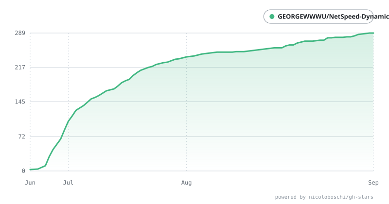

# NetSpeed Dynamic Pro (NSD)

<div align="center">


<h1>NetSpeed Dynamic Pro</h1>
<p>Dynamic Island for Windows</p>

[](https://tauri.app)
[](https://rust-lang.org)
[](https://vuejs.org)
[](https://www.typescriptlang.org)
[](https://vite.dev)
[](https://echarts.apache.org)

[简体中文](./README.md) &nbsp; | [English](./README.en.md) &nbsp; | [Download](https://github.com/GEORGEWWWU/NetSpeed-Dynamic/releases/latest) &nbsp; | [Website](https://nsd.georgewu.top/) &nbsp; | [QQ Group：1080730621](https://qm.qq.com/cgi-bin/qm/qr?k=i70z7rbl-VWpejQugvlXeARDUjwP7sIW&jump_from=webapi&authKey=b6Pj6zLuuCINDhafPJRttePdy3D45vvtWzcZ109LWoWYXkcKo8bNWI7fMhr+yV87)

</div>


---

NetSpeed Dynamic Pro (NSD) is a Windows desktop application built with Tauri 2, Vue 3, TypeScript, and Rust. It packages real-time network monitoring, system resource visibility, music control, toast notifications, taskbar plugin support, and personalization into a floating Dynamic Island interface.

## Highlights

- Monitor upload and download activity in real time with live traffic stats, monthly totals, and trend charts
- Display network, music, message, CPU, RAM, and system status in a floating Dynamic Island UI
- Support multi-platform media control through the Windows SMTC ecosystem and system media sessions
- Capture incoming Toast notifications and render them as on-screen cards with silent mode, priority handling, and click-to-open actions
- Offer light, dark, immersive, transparent, rounded, scaled, lyric-delay, glow-border, and audio-spectrum customization
- Support startup launch, tray icon control, taskbar plugin sync, FPS plugin, fullscreen auto-hide, position locking, and pinning

## Core Features

### 1. Network Monitoring

- Refresh upload and download speed every second with automatic unit conversion
- Show network health state for normal, high-latency, and disconnected conditions
- Provide local total traffic stats and monthly traffic charts
- Switch between bar and line chart views in the control panel
- Use dual-address timeout checks and high-traffic fluctuation logic to reduce false network disconnections
- Sync live speed information to taskbar plugins for desktop-side status monitoring

### 2. Music and Media Control

- Use the Windows SMTC API to control previous / play-pause / next
- Support NetEase Cloud Music, Spotify, Apple Music, QQ Music, Kugou Music, Echo Music, LX Music, and JustSolo
- Automatically identify the active media session and prioritize local SMTC cover art
- Support cover fallback, lyric lookup, lyric sync, delay adjustment, and playback progress display
- Enable live track info switching, cover rotation, and lyric animation during playback

### 3. Notifications and System Events

- Receive system Toast notifications and render them inside the Dynamic Island
- Support notification filtering, silent mode, priority handling, and click-to-open actions
- Watch for volume changes, power plugging/unplugging, lock/unlock, and low-battery events
- Use event-specific icons, colors, and style variations for different system messages
- Manage these messages through the theme, transparency, border, size, and display-combination settings

### 4. Taskbar Components and Desktop Integration

- Expose a taskbar plugin that mirrors live speed, lyrics, messages, and resource info in a desktop-side companion component
- Support an FPS plugin to display frame rate data in a separate window
- Keep the app accessible through the tray icon
- Auto-hide the island during fullscreen gaming or video playback
- Support position reset, lock, glow border toggling, always-on-top behavior, and multiple border styles

### 5. Personalization Center

- Switch between light, dark, immersive, transparent, rounded, scaled, and language options
- Tune “dynamic and physical feedback” with fast and bouncy spring animation styles
- Configure sizing boundaries such as base width, base height, media-card width, message-card width, and music base width
- Use custom display combinations to arrange speed, resource, FPS, and cover slots as needed
- Configure taskbar components, lyric delay, glow border, theme colors, and interface language

### 6. Audio Spectrum and Visual Effects

- Sample system output audio and perform FFT analysis to generate 7-band dynamic spectrum bars
- Use a symmetrical “hill” distribution to make music scenes look more vivid
- Drive island animation and glow effects from the spectrum output for richer visual feedback

## Tech Stack

| Layer | Technology |
|-------|------------|
| Desktop Framework | Tauri 2 (Rust) |
| Frontend Framework | Vue 3 + TypeScript |
| Build Tool | Vite 6 |
| Router | Vue Router 5 |
| Charts | ECharts 6 |
| Icons | Lucide Vue Next |
| Network Monitoring | sysinfo (Rust) |
| Async Runtime | Tokio (Rust) |
| HTTP Client | reqwest (Rust) |
| Media Control | Windows SMTC API |
| Audio Processing | cpal + realfft |
| System Events | Windows COM / WinAPI |
| Taskbar Communication | WebSocket + Tauri command |
| Storage | localStorage |

## Project Structure

```text
NetSpeed-Dynamic/
├── src/                           # Frontend source
│   ├── App.vue                    # App root
│   ├── main.ts                    # App entry
│   ├── i18n.ts                    # Chinese/English localization
│   ├── router/
│   │   └── index.ts               # Routing config
│   ├── views/
│   │   ├── MainPanel.vue           # Main console UI
│   │   └── WidgetIsland.vue        # Floating Dynamic Island
│   ├── components/
│   │   └── DynamicSet.vue          # Personalization center
│   └── assets/                    # Icons, screenshots, and static assets
├── src-tauri/                     # Tauri Rust backend
│   ├── src/
│   │   ├── lib.rs                  # Core logic, windows, animation, tray, and plugins
│   │   ├── music_controller.rs     # Media control, cover art, and lyrics
│   │   ├── notification.rs         # System notification capture
│   │   ├── system_events.rs         # Volume, battery, lock, and power events
│   │   └── audio_spectrum.rs       # Audio spectrum analysis
│   ├── Cargo.toml                 # Rust dependencies
│   ├── tauri.conf.json            # Tauri config
│   └── icons/                     # App icons
├── package.json                   # Frontend dependencies and scripts
├── README.md                      # Chinese documentation
├── README.en.md                   # English documentation
├── LICENSE                        # MIT License
└── .github/                       # GitHub workflows and star history assets
```

## Development Environment

### Prerequisites

- Windows 10/11
- Node.js 18+
- Rust 1.70+
- Tauri 2 CLI

### Install and Run

```bash
git clone https://github.com/GEORGEWWWU/NetSpeed-Dynamic.git
cd NetSpeed-Dynamic
npm install
npm run tauri dev
```

### Build for Release

```bash
npm run tauri build
```

The output is generated in `src-tauri/target/release/bundle/`.

## Usage

1. Launch the app to open the main console.
2. Turn on the widget switch to show the floating Dynamic Island.
3. Drag the island with the mouse, then use the right-click menu to lock, reset, close, toggle the glow border, or keep it on top.
4. Configure media platform selection, notification preferences, theme, opacity, startup behavior, taskbar plugin, and FPS plugin settings.
5. Open the Personalization Center to adjust physics, appearance, size, scaling, lyric delay, and custom display combinations.

> Note: This project is deeply adapted for Windows and depends on system SMTC, WinAPI, COM, Notification Manager, and taskbar plugin interfaces.

## License

MIT License

Copyright (c) 2026 Ryen (GEORGEWU)

## Contributors & Star History

Thank you to all the developers who have contributed to this project!

<div align="left">
  <a href="https://github.com/GEORGEWWWU/NetSpeed-Dynamic/graphs/contributors">
    
  </a>
</div>

### Star History Trend

<div align="center">
  
</div>

## Support and Donation

If this project helps you, feel free to support the author:

| Method | Information |
|--------|-------------|
| WeChat Pay | [WeChat](./src/assets/wechat-pay.png) |
| Alipay | [Alipay](./src/assets/alipay.jpg) |
| GitHub Sponsors | [Support Here](https://github.com/sponsors/GEORGEWWWU) |

---

> Thank you to every supporter and user!